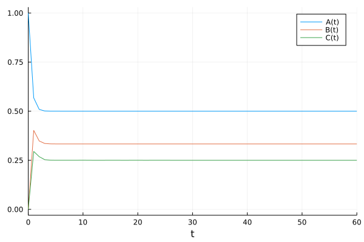
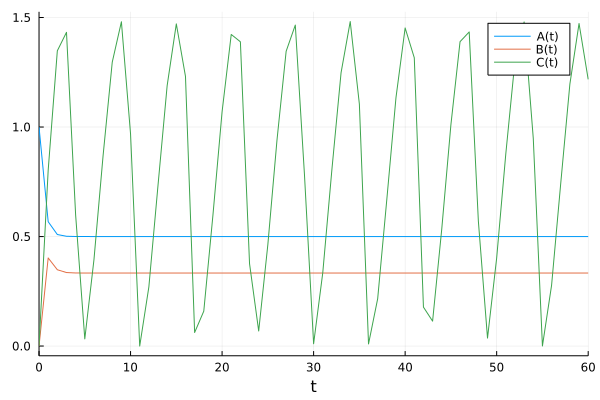

# CSV2JuliaDiffEq
Convert reactions and parameters defined in CSV files to DifferentialEquations.jl equations

## Example usage

### We need some packages


```julia
using DifferentialEquations
using Plots 
using CSV
using Distributions
using Random
using DataFrames
using FileIO

#plotly(); # if you want pretty graphs
```

# What is the same for all methods

All these methods use three files. 

reactions.csv:

| Substrate | Products | Kinetic Law | Modifiers | Parameters |
| --- | --- | --- | --- | --- |
| --- | A | Constant Exp | --- | k1_Aexp |
| A | B | Mass Action with substrate | --- | k1_AtoB |
| B | C | Mass Action with substrate | --- | k1_BtoC |
| C | --- | Mass Action with substrate | --- | k1_Cdeg |


parameters.csv: 


| Parameter | Value |
| ---| --- |
|k1_Aexp|1|
|k1_AtoB|2|
|k1_BtoC|3|
|k1_Cdeg|p(t)|

and ratelaws.csv:

|Rate Law Name|Rate Law Definition|
| --- | --- |
|Constant Exp|{k1}|
|Mass Action with substrate|[S1] * {k1}|

# The three ways to run a model

There are three ways to create model files with csv2julia. These are specified by the final argument to csv 2 jula.

## inline

This creates models with hardcoded parameters that look like this:

~~~julia 
function toyModel(dy,y,p,t)
        A=maximum([y[1],0])
        B=maximum([y[2],0])
        C=maximum([y[3],0])
        #A
        dy[1]= + 1 - A * 2
        #B
        dy[2]= + A * 2 - B * 3
        #C
        dy[3]= + B * 3 - C * p(t)
    end
~~~

## scan

This creates models where each parameter is a function call, to enable these to by dynamically updated at run time (but at a performance cost):

~~~julia 
function toyModel(dy,y,p,t)
	A=maximum([y[1],0])
	B=maximum([y[2],0])
	C=maximum([y[3],0])
	#A
	dy[1]= + paramFun("k1_Aexp",modify) - A * paramFun("k1_AtoB",modify)
	#B
	dy[2]= + A * paramFun("k1_AtoB",modify) - B * paramFun("k1_BtoC",modify)
	#C
	dy[3]= + B * paramFun("k1_BtoC",modify) - C * p(t)
end

~~~


## params

This creates models where each parameter is passed in through a list. This is the best way to do it if interfacing with JuliaDiffEqs sensitivity analysis functions etc.

~~~julia
    function toyModel(dy,y,p,t)
        A=maximum([y[1],0])
        B=maximum([y[2],0])
        C=maximum([y[3],0])
        #A
        dy[1]= + p[1] - A * p[2]
        #B
        dy[2]= + A * p[2] - B * p[3]
        #C
        dy[3]= + B * p[3] - C * p[4](t)
    end
~~~

# 1. inline: Example with all hardcoded parameters

This method creates models that look like this. All parameters are hardcoded directly as numbers (except any parameters that might be time dependent).

~~~julia 
function toyModel(dy,y,p,t)
        A=maximum([y[1],0])
        B=maximum([y[2],0])
        C=maximum([y[3],0])
        #A
        dy[1]= + 1 - A * 2
        #B
        dy[2]= + A * 2 - B * 3
        #C
        dy[3]= + B * 3 - C * p(t)
    end
~~~


```julia
reactionsFile="reactions.csv"
rateLawsFile="ratelaws.csv"
parametersFile="parameters.csv"
locationOfCSV2Julia="csv2model-multiscale.py"
thisModelName="toyModel.jl"
maxTimeTC=60;
```

First we'll make the time dependent variable just a constant


```julia
p=t->4
```


    #1 (generic function with 1 method)


```julia
arguments=[reactionsFile, parametersFile, rateLawsFile,thisModelName,"inline"]
cmd=`python3 $locationOfCSV2Julia $arguments`

#lets run csv2julia (requires python to be installed)
run(cmd)

#     #if we need to fix species we can do it here
#     #include("variableNames.jl")
#     #indexToFix=findfirst(x->"L"==x,syms)
#     #fixSpecies(modelFile,modelFile,indexToFix)

#pop the outputs in a modelFiles folder
include(thisModelName)
include("variableNames.jl")
```

    inline
    Running CSV2JuliaDiffEq with parameters hard-coded into the CSV file, if this is not correct, re-run with the 5th argument set to 'scan' or 'param'
    Opening ratelaws.csv as rate law file
    Opening parameters.csv as parameters file
    Opening reactions.csv as reactions file


    3-element Vector{String}:
     "A"
     "B"
     "C"


```julia
y0=[1,0,0];
f=ODEFunction(toyModel,syms=Symbol.(syms));
prob=ODEProblem(f,y0,(0.0,maxTimeTC),p);
sol=solve(prob, abstol=1e-5,reltol=1e-3, saveat=1.0);
plot(sol)
```


    

    


This is how you can make a variable time depenent:


```julia
p=t->(1/(sin(t)+1))
```


    #3 (generic function with 1 method)


```julia
prob=ODEProblem(f,y0,(0.0,maxTimeTC),p);
timeTaken = @timed sol=solve(prob, abstol=1e-5,reltol=1e-3, saveat=1.0);
println("solved in: "*string(timeTaken.time))
```

    solved in: 4.306023241


```julia
plot(sol)
```


    

    


# 2. scan: Example with parameters defined by a function

This model will be formatted as shown:
~~~julia 
function toyModel(dy,y,p,t)
	A=maximum([y[1],0])
	B=maximum([y[2],0])
	C=maximum([y[3],0])
	#A
	dy[1]= + paramFun("k1_Aexp",modify) - A * paramFun("k1_AtoB",modify)
	#B
	dy[2]= + A * paramFun("k1_AtoB",modify) - B * paramFun("k1_BtoC",modify)
	#C
	dy[3]= + B * paramFun("k1_BtoC",modify) - C * p(t)
end

~~~
An include file (scanIncludes.jl) will be created that looks like this:
~~~julia
    modify=Dict("k1_Aexp"=>1.0, "k1_AtoB"=>1.0, "k1_BtoC"=>1.0, )

    parameterList=Dict("k1_Aexp"=>1, "k1_AtoB"=>2, "k1_BtoC"=>3, )

    function paramFun(paramName,modify)
       return parameterList[paramName]*modify[paramName]
    end
~~~  
With this format parameters can be updated using the modify dictionary at run time:
~~~julia
    modify["k_binding"]=1.5
~~~


```julia
arguments=[reactionsFile, parametersFile, rateLawsFile,thisModelName,"scan"]
cmd=`python3 $locationOfCSV2Julia $arguments`

#lets run csv2julia (requires python to be installed)
run(cmd)

#     #if we need to fix species we can do it here
#     #include("variableNames.jl")
#     #indexToFix=findfirst(x->"L"==x,syms)
#     #fixSpecies(modelFile,modelFile,indexToFix)

#pop the outputs in a modelFiles folder
include(thisModelName)
include("variableNames.jl")
include("scanIncludes.jl")
```

    scan
    Running CSV2JuliaDiffEq with parameters left as a function call to paramFun(n), for all params. We will also create a paramFun.jl file that should be included and defines all parameters. If this is incorrect, please re-run with 5th argument set to 'inline' or 'param'
    Opening ratelaws.csv as rate law file
    Opening parameters.csv as parameters file
    Opening reactions.csv as reactions file
    parameters can now be modified by name.
    example to modify k_binding 1.5 fold higher:
    modify["k_binding"]=1.5


```julia
p=t->4
```


    #5 (generic function with 1 method)


```julia
y0=[1,0,0];
f=ODEFunction(toyModel,syms=Symbol.(syms));
prob=ODEProblem(f,y0,(0.0,maxTimeTC),p);
sol=solve(prob, abstol=1e-5,reltol=1e-3, saveat=1.0);
```


```julia
plot(sol)
```


    

    


```julia
p=t->(1/(sin(t)+1))
```


    #7 (generic function with 1 method)


```julia
prob=ODEProblem(f,y0,(0.0,maxTimeTC),p);
timeTaken = @timed sol=solve(prob, abstol=1e-5,reltol=1e-3, saveat=1.0);
println("solved in: "*string(timeTaken.time))
```

    solved in: 4.251763695


```julia
plot(sol)
```


    

    


# 3. params: Example with parameters defined by a list

For this version we need to slightly tweak the reactions file so that time dependent variables are defined in line. The file will look like this:


| Parameter | Value |
| ---| --- |
|k1_Aexp|1|
|k1_AtoB|2|
|k1_BtoC|3|
|k1_Cdeg|**t->tdfunc(t)**|


(see parametersTD.csv)

This model will be formatted as shown:
~~~julia
    function toyModel(dy,y,p,t)
        A=maximum([y[1],0])
        B=maximum([y[2],0])
        C=maximum([y[3],0])
        #A
        dy[1]= + p[1] - A * p[2]
        #B
        dy[2]= + A * p[2] - B * p[3]
        #C
        dy[3]= + B * p[3] - C * p[4](t)
    end
~~~

An include file (scanIncludes.jl) will be created that looks like this:
~~~julia
    paramVals=[
    1 #p[0] is k1_Aexp
    2 #p[1] is k1_AtoB
    3 #p[2] is k1_BtoC
    t->tdfunc(t) #p[3] is k1_Cdeg
    ]

    parameterNameList=["k1_Aexp" #parameterNameList[0]=1
    "k1_AtoB" #parameterNameList[1]=2
    "k1_BtoC" #parameterNameList[2]=3
    "k1_Cdeg" #parameterNameList[3]=t->tdfunc(t)
    ]
~~~  
With this format parameters can be updated using the above two variables at run time:
~~~julia
    indexOfParam=findfirst(x->"k_binding"==x,parameterNameList)
    paramVals[indexOfParam]=paramVals[indexOfParam]*1.5
~~~


```julia
parametersFile="parametersTD.csv"
```


    "parametersTD.csv"


This is an example of how to defined a time dependent variable. Please note that this *cannot* be called 'p' because that is used for the entire parameters variable inside the ODE file. The first example is just a constant variable, below we'll give an example that is time dependent. 


```julia
tdfunc=t->4
```


    #9 (generic function with 1 method)


```julia
arguments=[reactionsFile, parametersFile, rateLawsFile,thisModelName,"param"]
cmd=`python3 $locationOfCSV2Julia $arguments`

#lets run csv2julia (requires python to be installed)
run(cmd)

#     #if we need to fix species we can do it here
#     #include("variableNames.jl")
#     #indexToFix=findfirst(x->"L"==x,syms)
#     #fixSpecies(modelFile,modelFile,indexToFix)

#pop the outputs in a modelFiles folder
include(thisModelName)
include("variableNames.jl")
include("scanIncludes.jl")
```

    param
    Running CSV2JuliaDiffEq with parameters dynamically determined by a variable, re-run with the 5th argument set to 'scan' or 'inline'
    Opening ratelaws.csv as rate law file
    Opening parametersTD.csv as parameters file
    Opening reactions.csv as reactions file
    parameters can now be searched in parameterNameList by name.
    example to modify k_binding 1.5 fold higher:
    indexOfParam=findfirst(x->"k_binding"==x,parameterNameList)
    paramVals[indexOfParam]=paramVals[indexOfParam]*1.5


```julia
y0=[1,0,0];
f=ODEFunction(toyModel,syms=Symbol.(syms));
prob=ODEProblem(f,y0,(0.0,maxTimeTC),paramVals);
sol=solve(prob, abstol=1e-5,reltol=1e-3, saveat=1.0);
```


```julia
plot(sol)
```


    

    


This is an example of re-solving with a time dependent variable:


```julia
tdfunc=t->(1/(sin(t)+1))
```


    #13 (generic function with 1 method)


```julia
prob=ODEProblem(f,y0,(0.0,maxTimeTC),paramVals);
timeTaken = @timed sol=solve(prob, abstol=1e-5,reltol=1e-3, saveat=1.0);
println("solved in: "*string(timeTaken.time))
```

    solved in: 0.022232845


```julia
plot(sol)
```


    

    


```julia

```
